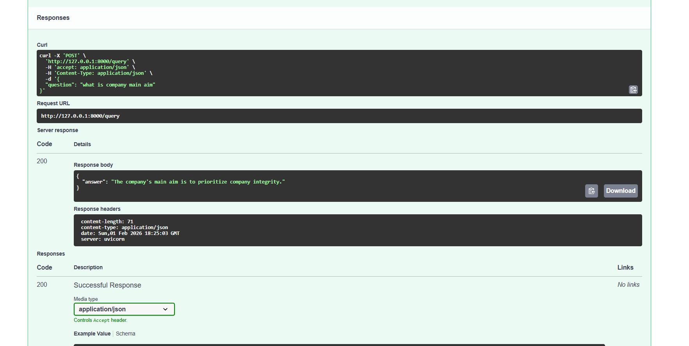
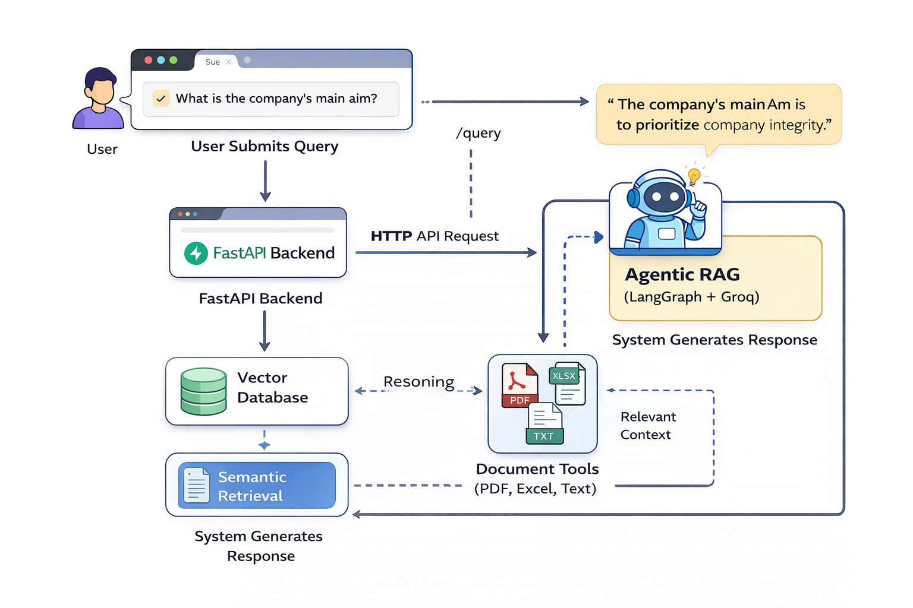
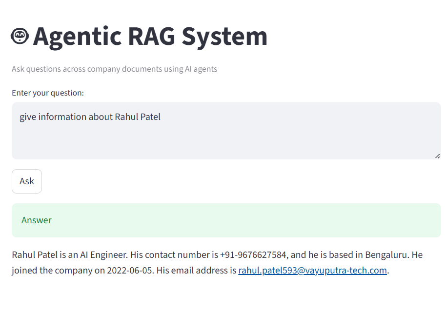

# Agentic RAG System

## 📌 Project Overview
This project implements an **Agentic Retrieval-Augmented Generation (RAG) system** that intelligently answers user questions using enterprise documents such as **PDFs, Excel files, and text files**.

Unlike traditional RAG pipelines, this system demonstrates **agentic behavior**, where an AI agent dynamically reasons about the user query, selects the appropriate tool, retrieves relevant context from a vector database, and generates grounded responses.

The system is fully **API-driven**, **UI-enabled**, and **Dockerized** for local and cloud deployment.

---

## 🖼️ Output Screenshots
All output screenshots are stored in the **`images/`** folder at the root of this repository.

Example screenshots include:
- Backend API response (FastAPI /docs)
- Successful query execution
- Streamlit UI interaction

You can find them here:
```
images/
├── api_success.png
├── ui_output.png
```

> These images are referenced for demo, documentation, and video presentation purposes.

---

## 🎯 Key Features
- Agentic query reasoning and decision-making
- Retrieval-Augmented Generation (RAG)
- Vector-based semantic search
- Multi-format document support:
  - PDF
  - Excel
  - Text
- FastAPI backend
- Streamlit UI
- Groq LLM integration
- Dockerized and AWS EC2 deployable

---

## 🏗️ System Architecture

```
User
 ↓
Streamlit UI
 ↓
FastAPI Backend
 ↓
Agentic RAG Engine (LangGraph + Groq)
 ↓
Vector Database + Document Tools
```

---

## 🧠 Agentic Workflow

1. **User Query Submission**  
   The user submits a question via the UI or API.

2. **Agent Reasoning**  
   An LLM-powered agent analyzes the intent of the query and decides whether retrieval is required.

3. **Dynamic Tool Selection**  
   The agent selects the appropriate tool corresponding to the data source (PDF, Excel, or text).

4. **Retrieval (RAG)**  
   Relevant document chunks are retrieved from the vector database.

5. **Grounded Generation**  
   The LLM generates an answer strictly based on retrieved context.

6. **Response Delivery**  
   The final answer is returned via the backend API and displayed in the UI.

This workflow ensures **dynamic decision-making**, **reduced hallucination**, and **scalable retrieval**.

---

## 📂 Project Structure

```
agentic-rag-mcp/
│
├── agent.py                  # LangGraph agent workflow
├── backend/
│   ├── main.py               # FastAPI backend
│   ├── agent_runner.py       # Agent execution wrapper
│
├── ui/
│   └── app.py                # Streamlit UI
│
├── tools/                    # Data source tools
├── Data/                     # Sample documents
├── images/                   # Output screenshots
│
├── Dockerfile
├── docker-compose.yml
├── requirements.txt
├── .gitignore
└── README.md
```

---

## ⚙️ Local Setup

### 1️⃣ Clone Repository
```bash
git clone https://github.com/<your-username>/agentic-rag-mcp.git
cd agentic-rag-mcp
```

### 2️⃣ Create `.env`
```env
GROQ_API_KEY=your_api_key_here
```

---

## ▶️ Run Without Docker

### Backend
```bash
uvicorn backend.main:app --reload
```
Open:
```
http://127.0.0.1:8000/docs
```

### UI
```bash
streamlit run ui/app.py
```
Open:
```
http://localhost:8501
```

---

## 🐳 Run With Docker

### Build Image
```bash
docker build -t agentic-rag:latest .
```

### Run Services
```bash
docker-compose up
```

Access:
- Backend: http://localhost:8000/docs
- UI: http://localhost:8501

---

## ☁️ AWS EC2 Deployment (Docker)

1. Build and push Docker image to Docker Hub.
2. Pull the image on EC2.
3. Run using `docker-compose`.

This approach avoids heavy builds on the server and improves deployment reliability.

---

## 🔐 Security
- API keys are managed via environment variables.
- `.env` and `venv` are excluded using `.gitignore`.

---

## ⚠️ Limitations
- MCP servers are not used in the current implementation.
- Chat history is not persisted across sessions.


## 📽️ Demo
A short demo video demonstrates:
- Agentic workflow
- API interaction
- UI query execution

---
<p align="center">
  
  
  

</p>

## 🏁 Conclusion
This project demonstrates how **agentic reasoning**, **retrieval augmentation**, and **scalable system design** can be combined to build intelligent AI-powered enterprise systems.

